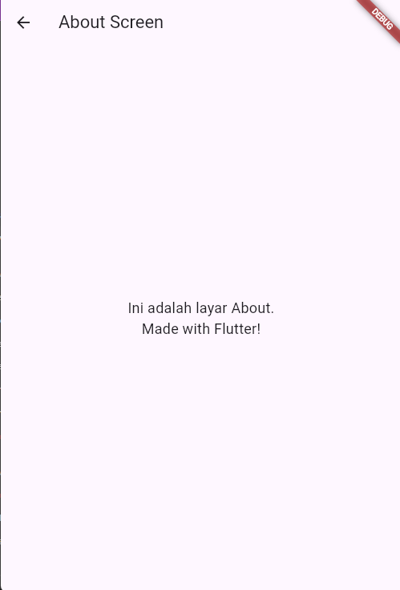
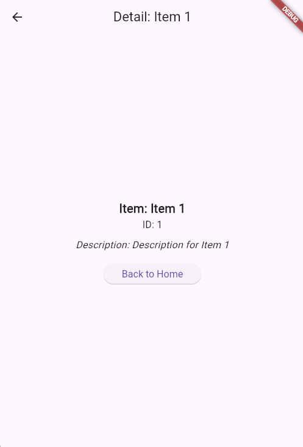
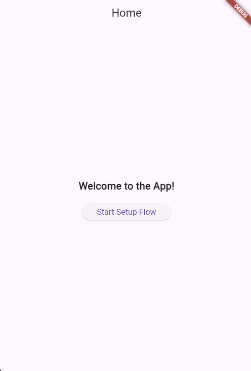
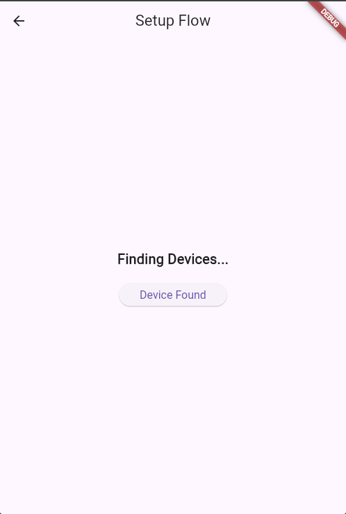
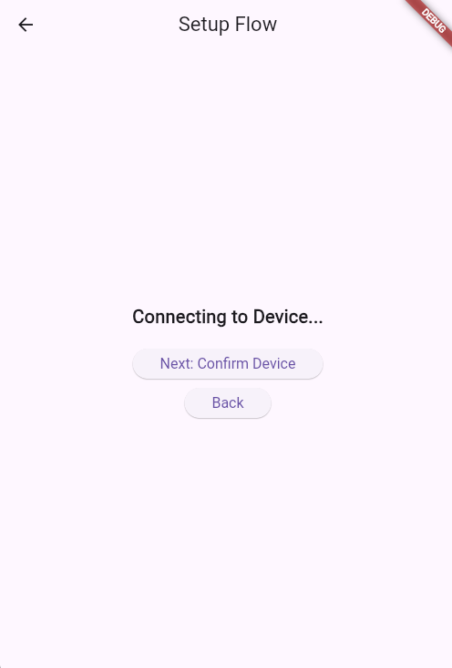
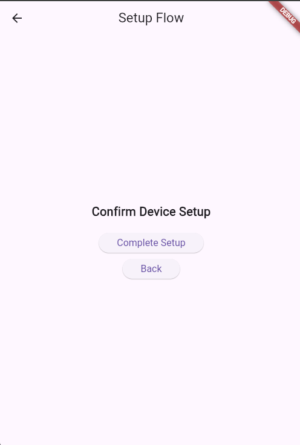
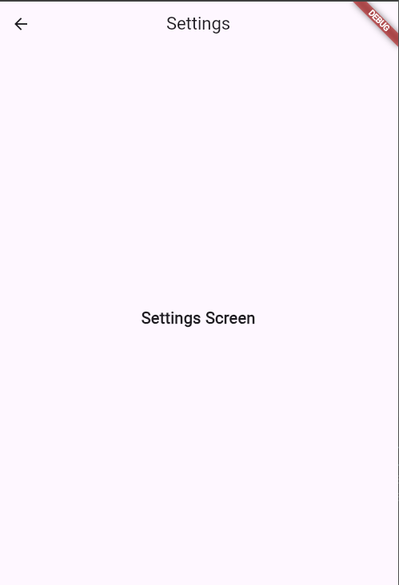

# Navigasi Flutter Praktikum

Repositori ini berisi kumpulan praktikum Flutter yang membahas berbagai jenis navigasi yang umum digunakan dalam pengembangan aplikasi mobile menggunakan Flutter.

---

## 🎯 Tujuan Praktikum

Praktikum ini bertujuan untuk memperdalam pemahaman mahasiswa terhadap berbagai teknik navigasi dalam Flutter, mulai dari yang paling dasar hingga navigasi yang lebih kompleks dan modern. Dengan memahami Named Routes, Navigator 2.0, Nested Navigation, dan Deep Linking, mahasiswa diharapkan mampu membangun alur navigasi aplikasi yang lebih terstruktur, efisien, dan scalable, baik untuk aplikasi mobile maupun web.

---

## 🚀 Pengantar Jenis Navigasi di Flutter

### Named Routes  
Navigasi dengan mendefinisikan rute secara statis di `MaterialApp.routes` dan menggunakan `Navigator.pushNamed`. Cocok untuk aplikasi kecil sampai menengah dengan struktur rute yang sederhana.

  
*Gambar: Halaman Home menggunakan Named Routes.*

---

### Navigator 2.0 (Router API)  
Navigasi modern menggunakan `Router`, `RouteInformationParser`, dan `RouterDelegate`. Memberikan kontrol penuh terhadap URL dan state navigasi, sangat cocok untuk aplikasi skala besar dan web.

  
*Gambar: Halaman Detail diakses melalui deep link dengan parameter ID.*

---

### Nested Navigation  
Navigasi bertingkat di dalam satu halaman induk, cocok untuk alur bertahap seperti onboarding atau setup wizard. Menggunakan `Navigator` internal dengan `GlobalKey<NavigatorState>`.

  
*Gambar: Langkah-langkah bertahap pada Nested Navigation.*
  
*Gambar: Langkah-langkah bertahap pada Nested Navigation.*
  
*Gambar: Langkah-langkah bertahap pada Nested Navigation.*
  
*Gambar: Langkah-langkah bertahap pada Nested Navigation.*
---

### Deep Linking  
Mendukung akses halaman secara langsung menggunakan URL, misalnya `/detail/2` atau `/settings`. Implementasi dengan `Router`, `RouteInformationParser`, dan `RouterDelegate`. Cocok untuk aplikasi web atau integrasi dengan link eksternal.

  
*Gambar: Halaman Settings dapat diakses langsung via deep link.*

---
